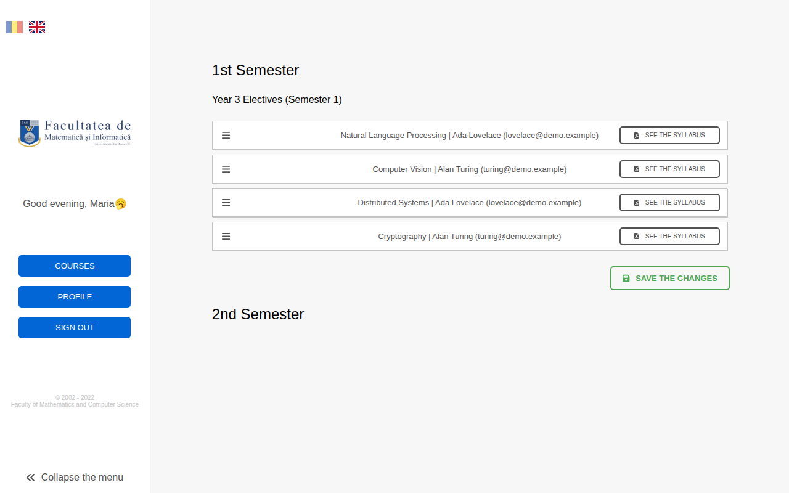
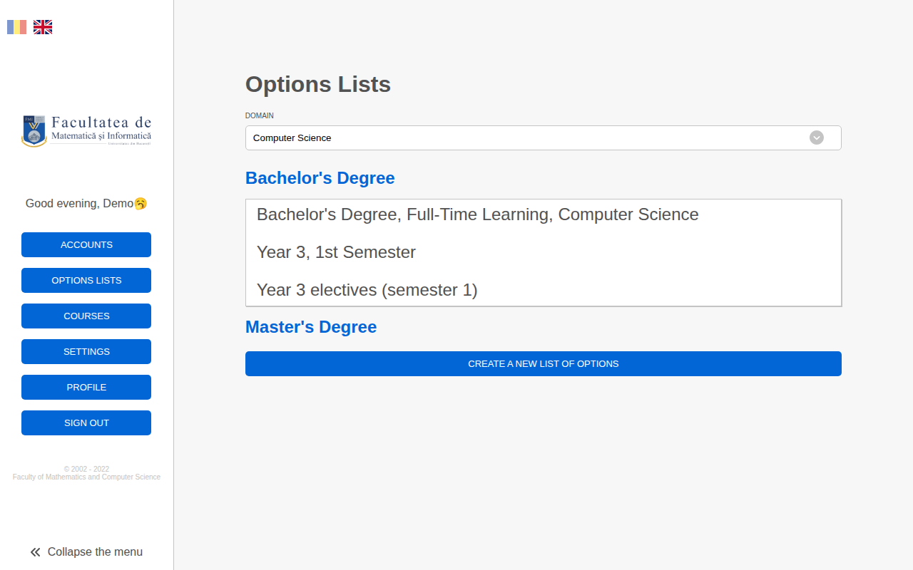
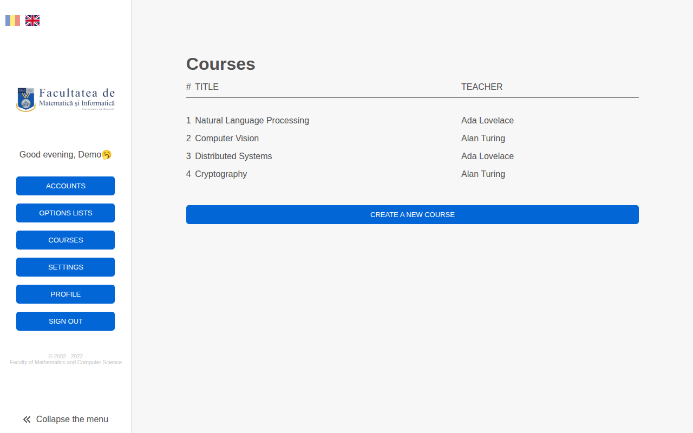

# Elective course selection platform

> **Original version:** this README and some fixes were added in 2026. To see the project exactly as it was first built, browse commit [`627b847`](https://github.com/dianapaula19/graduation-project/tree/627b847ff770012889b5d7933be09a8607c0e69f) (2023-12-10).

Bachelor's graduation project (2022) at the Faculty of Mathematics and Computer Science,
University of Bucharest, by [Diana Băcîrcea](https://github.com/dianapaula19).

Every year, students choose their elective ("optional") courses for the next year by ranking them
in order of preference. This platform replaces the spreadsheets and emails behind that process:

- **Admins** import students and teachers from `.xlsx` files, create courses and *options lists*
  (the electives offered to one study programme, year and semester), and open or close the
  selection session.
- **Students** rank the courses of each list by drag and drop while the session is open.
- When the admin **closes the session**, seats are assigned automatically: students are served
  in order of their grade, each getting their highest-ranked course that still has room, and
  leftover seats go to students whose choices were all full.
- **Teachers** see who is enrolled in their courses and can email announcements to them.

The interface is available in Romanian and English. Demo video: https://youtu.be/sEHrhPenFeI

| Login | Student: ranking electives |
|---|---|
|  |  |
| **Admin: options lists** | **Admin: courses** |
|  |  |

## Stack

- **Frontend:** React 17, TypeScript, Redux Toolkit, SCSS, i18next (`frontend/`)
- **Backend:** Django, Django REST Framework with token auth, Channels (live session status over
  WebSockets), password reset by email (`backend/`)

## Running locally

### With Docker

```bash
cp backend/backend/.env.example backend/backend/.env
docker-compose up
```

Client on http://localhost:3000, API on http://localhost:8000.

### Without Docker

Backend (Python 3.10+):

```bash
cd backend
python -m venv venv && source venv/bin/activate
pip install -r requirements.txt
cp backend/.env.example backend/.env
python manage.py migrate
python manage.py seed_demo      # optional: fictional demo accounts, courses and an options list
python manage.py runserver
```

`seed_demo` needs an empty database; delete or move the bundled `db.sqlite3` first. It prints
the demo logins (admin, teacher and student; password `demo1234`).

Frontend (Node 18+):

```bash
cd frontend
npm install
REACT_APP_SERVER_APP_LINK_DEV=localhost:8000 npm start
```

### Tests

```bash
cd backend && python manage.py test
```

Covers login, the role permissions, opening the selection session and the seat assignment.
